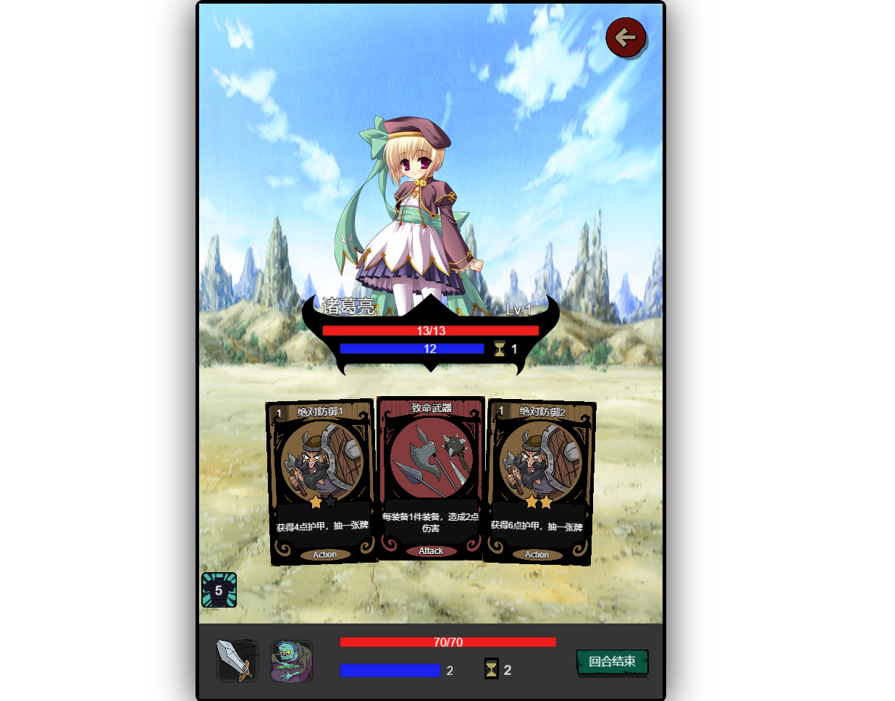
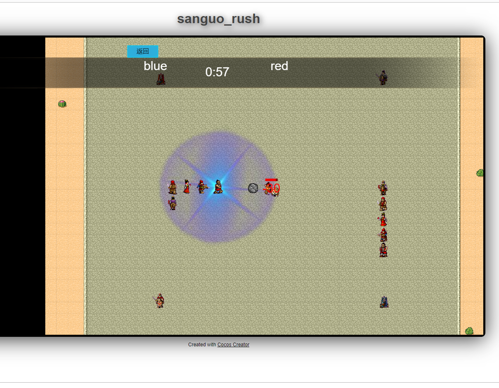
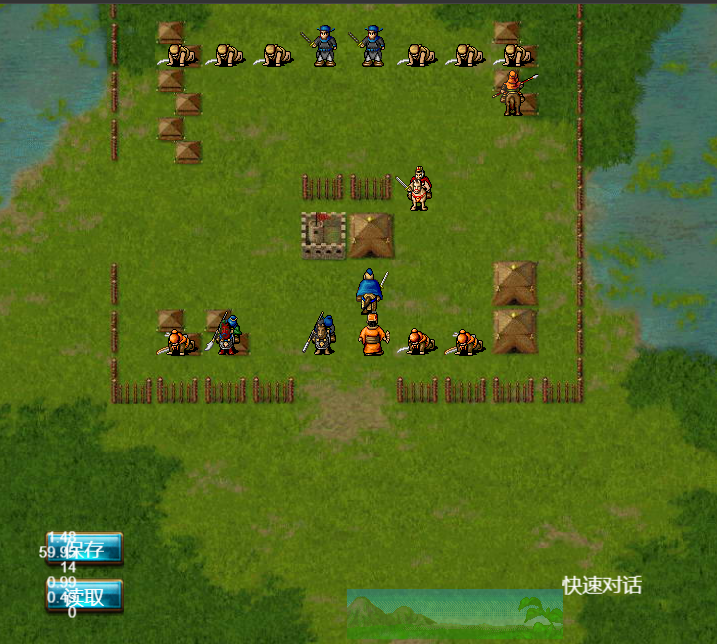
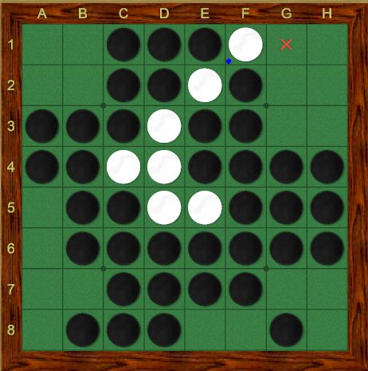
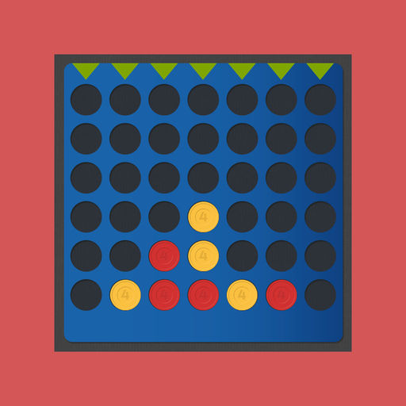
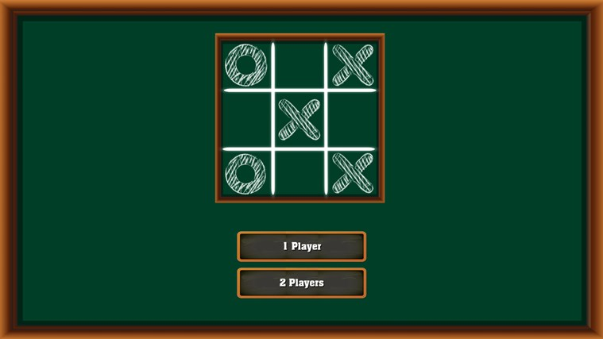
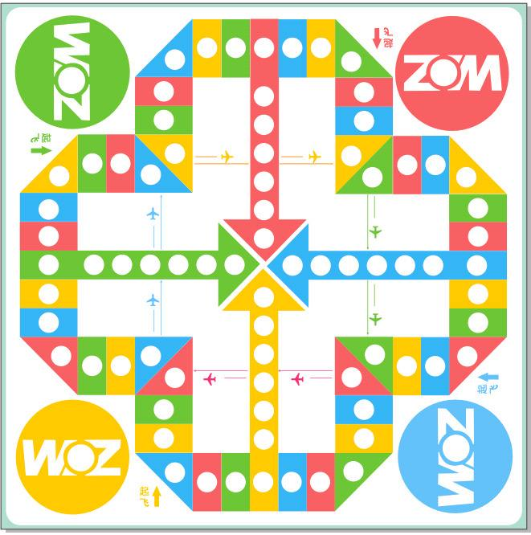

### 三国卡牌Roguelike

{:height="50%" width="50%"}
* 玩法：类似月圆之夜，
* Demo：[https://livingyang.github.io/SanguoQuestDemo/](https://livingyang.github.io/SanguoQuestDemo/)

### 三国贪食蛇Roguelike

{:height="50%" width="50%"}
* 玩法：三国版的贪食蛇，每段蛇身由不同的英雄组成，每个英雄有不同的攻击方式和技能
* Demo: [https://livingyang.github.io/sanguorush-demo/docs/web-desktop/](https://livingyang.github.io/sanguorush-demo/docs/web-desktop/)

### 三国自走棋

{:height="50%" width="50%"}
* 玩法：基于三国曹操传引擎的自走棋玩法

### 黑白棋
{:height="50%" width="50%"}
* 玩法：经典的黑白棋

### 双陆棋
{:height="50%" width="50%"}
* 玩法：经典的双陆棋

### 四子棋
{:height="50%" width="50%"}
* 玩法：经典的四子棋

### 井字棋
{:height="50%" width="50%"}
* 玩法：经典的四子棋

### 五子棋
{:height="50%" width="50%"}
* 玩法：经典的四子棋

### 飞行棋
{:height="50%" width="50%"}
* 玩法：经典的四子棋

### 物理游戏

* Rolling Fall 砸僵尸

### 休闲游戏

* 打鬼子

